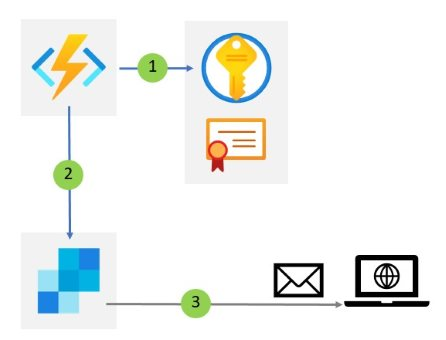
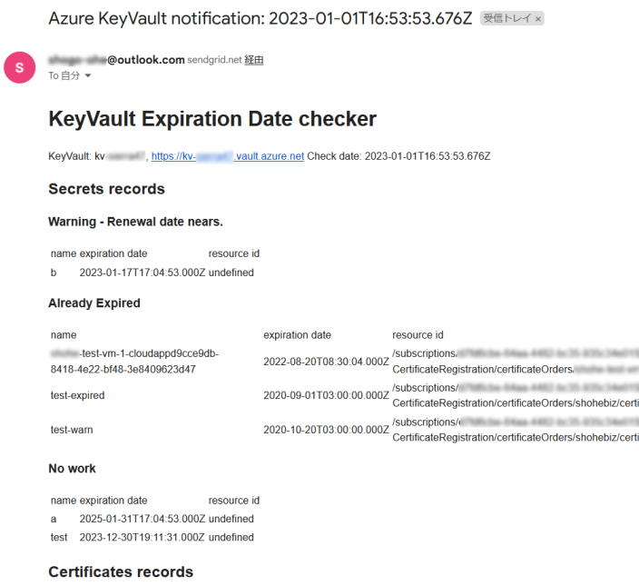

# Azure Key Vault Expiration Date Checker
このレポジトリは、[Azure Key Vault](https://learn.microsoft.com/ja-jp/azure/key-vault/) に格納されたシークレット、証明書の有効期限を検査する [Azure Functions](https://learn.microsoft.com/ja-jp/azure/azure-functions/) コードが格納されています。

元々の目的は、Azure Key Vault のシークレットとして格納された App Sercvice 証明書の有効期限を通知する仕組みでした。
現在では、機能を拡張して、シークレットと証明書に設定された有効期限を元に残り期限が少ないものを通知する仕組みになっています。

# 仕組み
このコードは以下のような仕組みで動作しています。



1. Functions [Timer Trigger](https://learn.microsoft.com/ja-jp/azure/azure-functions/functions-bindings-timer?tabs=in-process&pivots=programming-language-javascript) で Key Vault に格納されたシークレットと証明書の有効期限を調べる
2. 有効期限を Functions [Sendgrid output binding](https://learn.microsoft.com/ja-jp/azure/azure-functions/functions-bindings-sendgrid?tabs=in-process%2Cfunctionsv2&pivots=programming-language-javascript) で送信する
3. E メールで通知が行われる 


# 使い方
このサンプルコードは Azure Functions ランタイムバージョン 4.x (4.14.0.19631)、Node.js v16LTS(v16.16.0)、Windows 従量課金プランでテストしています。

いくつかの設定を追加して、```func azure functionapp publish <FunctionAppName>``` コマンドで発行することで実行することが出来ます。

## Sendgrid の準備
Sendgrid は制限付きではありますが、無料プランがあります。以下のドキュメントに従って、無料または有料プランを準備します。
詳細は以下のドキュメントを参照して下さい。

- [Sending Email with Microsoft Azure](https://docs.sendgrid.com/for-developers/partners/microsoft-azure-2021)


API Key は発行時の 1 度しか表示されないので、メモ帳などに記録しておきます。 Restricted Access の 'Mail Send' だけで十分です。


## アプリケーション設定
確認対象の Azure Key Vault や Sendgrid を使用したメールの送受信のために、アプリケーション設定が必要です。
| 名前 | 値 | 意味 |
| ---- | -- | ---- |
| KEYVAULT_NAME | 参照する Azure Key Vault の名前 | 参照する Azure Key Vault の名前 |
| AzureWebJobsSendGridApiKey | SendGrid API Key | [AzureWebJobsSendGridApiKey は既定値](https://learn.microsoft.com/ja-jp/azure/azure-functions/functions-bindings-sendgrid?tabs=in-process%2Cfunctionsv2&pivots=programming-language-javascript#configuration) |
| SendGrid_email_to | メールアドレス | メールの送信先。','(カンマ) 区切りで複数指定可能 |
| SendGrid_email_from | メールアドレス | メールの送信元。Sendgrid の送信元として Sender Authentication が確認済のもの |
| EXPIRATION_THRESHOLD_INDAYS | 日数 | 警告の対象とする日数 |


Azure CLI ([az functionapp config appsettings set](https://learn.microsoft.com/ja-jp/cli/azure/functionapp/config/appsettings?view=azure-cli-latest#az-functionapp-config-appsettings-set)) を使用した設定は以下が使用できます。
```
$FunctionappName = "Functions リソース名"
$ResourceGroupName = "リソースグループ名"
az functionapp config appsettings set --name $FunctionappName --resource-group $ResourceGroupName  --settings "KEYVAULT_NAME=Azure Key Vault リソース名"
az functionapp config appsettings set --name $FunctionappName --resource-group $ResourceGroupName  --settings "AzureWebJobsSendGridApiKey=SG.APIkey"
az functionapp config appsettings set --name $FunctionappName --resource-group $ResourceGroupName  --settings "SendGrid_email_to=foo@gmail.com, bar@outlook.com"
az functionapp config appsettings set --name $FunctionappName --resource-group $ResourceGroupName  --settings "SendGrid_email_from=example@outlook.com"
az functionapp config appsettings set --name $FunctionappName --resource-group $ResourceGroupName  --settings "EXPIRATION_THRESHOLD_INDAYS=45"
```

## マネージド ID の有効化
Azure Functions 上のコードから Azure Key Vault にアクセスするための認証手段が必要です。
ここではマネージド ID を使用します。

手順は以下の通りです。
1. Azure Functions で[システム割り当てのマネージド ID を有効化](https://learn.microsoft.com/ja-jp/azure/app-service/overview-managed-identity?tabs=portal%2Chttp) する
2. Azure Key Vault の [アクセスポリシーで Functions からのアクセス権を付与する](https://learn.microsoft.com/ja-jp/azure/active-directory/managed-identities-azure-resources/tutorial-windows-vm-access-nonaad#grant-access) する

アクセスポリシーで必要な許可は、シークレットの一覧と取得 (Get, List) と証明書の一覧と取得 (Get, List) です。


# 実行例
正常に動作すると、以下のような内容が通知されます。



シークレットの内容と証明書の内容が "Secrets records", "Certificates records" で記載されます。
また、それぞれの内容について、有効期限切れが近い (EXPIRATION_THRESHOLD_INDAYS で指定した日数以内に切れる) 項目が "Warning - Renewal date nears." として、既に有効期限が切れている内容が "Already Expired"、有効期限が十分残っている内容が "No work" として表示されます。

シークレットが App Service 証明書である場合、"/subscriptions/..." で始まる App Service 証明書のリソース ID が表示されます。 
証明書である場合、証明書で指定された発行先 (CN:CommonName) も記載されます。
